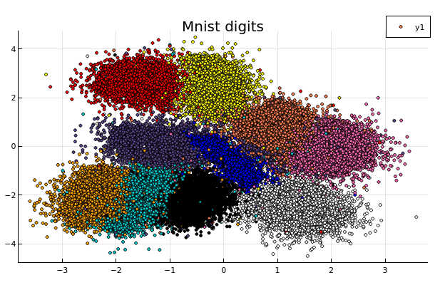
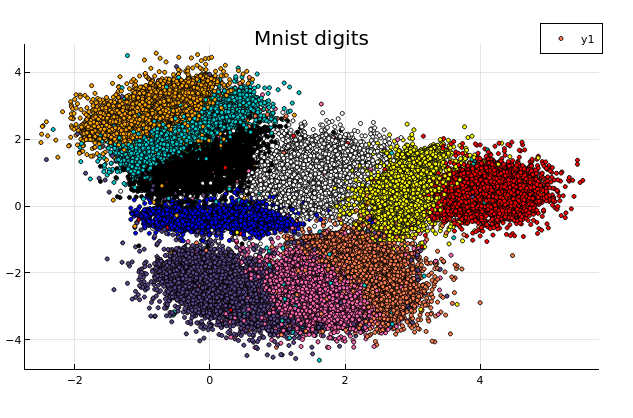

# A data embedding tool and related data analysis or clustering

The crate will provide:

1. Some variations on data embedding tools from t-Sne (2008) to Umap(2018).
   Our implementation is a mix of the various embedding algorithms
    recently published and mentioned in References.

   - The graph is initialized by the Hnsw nearest neighbour algorithm.  
     This provides for free, sub-sampling in the data to embed by considering only less densely occupied layers (the upper layers). This corresponds generally to a subsampling of 2%-4%, but can give a guarantee as the distance beetween points leaved out the sampling and its nearest sampled neighbour are known. The hnsw structure enables also an iterative initialization of the embedding by taking into account an increasing number of layers.
  
   - The preliminary graph built for the embedding uses an exponential function of distances to neighbour nodes (as in Umap). It is possible to modulate the initial edge weight by :
     - Considering a power of the distance function to neighbours (See documentation in EmbedderParams).  
     - Taking into account a local density of points. There is no symetrization of the graph. (except when initializing the embedding with diffusion maps in this case it is done as in t-sne or LargeVis). We use the diffusion maps algorithm (Lafon-Keller-Coifman).

   - We also use a cross entropy optimization of this initial layout but take into account the initial local density estimate of each point when computing the cauchy weight of an embedded edge.

2. An implementation of the Mapper algorithm using the C++ **Ripser** module from U. Bauer

3. Some by-products :
    - an implementation of range approximation and approximated SVD for dense and row compressed matrices as described in Halko-Tropp (Cf. [Tsvd](https://arxiv.org/abs/0909.4061)).
  
    - a Diffusion Maps implementation.

    - A single-linkage hierarchical clustering function

## *The crate is in a preliminary state*

Currently only the approximated SVD and a first version of the embedding are implemented. But the mnist example shows how to run the embedding, even in this (instable) state.

## Results

These are preliminary results.
Timings are given for a 4-core i7-2.7 Ghz laptop.

### Embedder

1. MNIST digits database  Cf [mnist-digits](http://yann.lecun.com/exdb/mnist/)

It consists in 70000 images of handwritten digits of 784 pixels

- initialized by an approximated svd.
It tooks 50s to run, of which 18s were spent in the ann construction.

- hierarchical initialization

It took 60s of which 18s were spent in the ann construction.

### Randomized SVD

### Mapper

## Docs

The documentation uses Katex (see the *katex_doc* crate) to render some formulas.
To build the doc with display of equations, set in your environment :  

RUSTDOCFLAGS=--html-in-header katex-header.html  

and run cargo rustdoc -- --html-in-header katex.html

## References

- Visualizing data using t_sne.
  Van der Maaten and Hinton 2008.

- Visualizing Large Scale High Dimensional Data
  Tang Liu WWW2016 2016 [LargeVis](https://arxiv.org/pdf/1602.00370.pdf)
  
- Phate Visualizing Structure and Transitions for Biological Data Exploration
  K.R Moon 2017.

- Umap: Uniform Manifold Approximation and Projection for Dimension Reduction.
  L.MacInnes, J.Healy and J.Melville 2018

## License

Licensed under either of

1. Apache License, Version 2.0, [LICENSE-APACHE](LICENSE-APACHE) or <http://www.apache.org/licenses/LICENSE-2.0>
  
2. MIT license [LICENSE-MIT](LICENSE-MIT) or <http://opensource.org/licenses/MIT>

at your option.

This software was written on my own while working at [CEA](http://www.cea.fr/)
