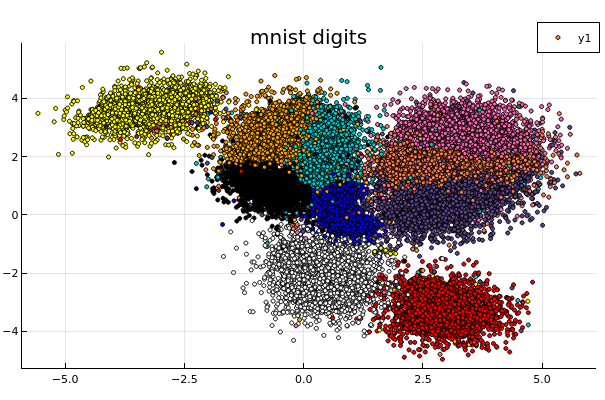
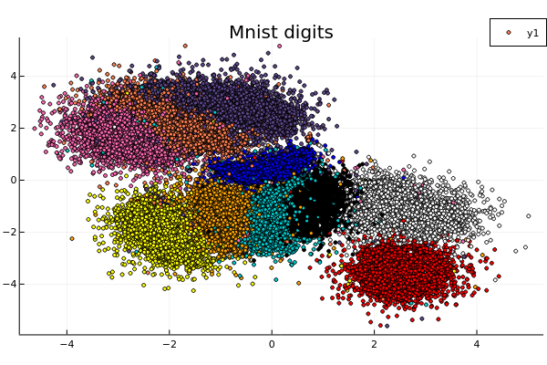

# A data embedding tool and related data analysis or clustering

The crate will provide:

1. Some variations on data embedding tools from t-Sne (2008) to Umap(2018).
   Our implementation is in fact a mix of the various embedding algorithms
    recently published and mentioned in References.

   - The graph is initialized by the Hnsw nearest neighbour algorithm.  
     This provides for free sub-sampling in the data to embed by considering only less densely occupied layers (the upper layers). This corresponds generally to a subsampling of 2%-4%, but can give a guarantee as the distance beetween points leaved out the sampling and its nearest sampled neighbour are known.
  
   - The preliminary graph built for the embedding uses an exponential kernel (as in Umap) taking into account a local density of points. There is no symetrisation of the graph. (except when initializing the embedding with diffusion maps in this case it is done as in t-sne or LargeVis. We use the diffusion maps algorithm (Lafon-Keller-Coifman), even though we have an exponential kernel.

   - We also use a cross entropy optimization of this initial layout but take into account the initial local density estimate of each point when computing the cauchy weight of an embedded edge.

2. An implementation of the Mapper algorithm using the C++ **Ripser** module from U. Bauer

3. Some by-products :
    - an implementation of range approximation and approximated SVD for dense and row compressed matrices as described in Halko-Tropp (Cf. [Tsvd](https://arxiv.org/abs/0909.4061)).

    - A single-linkage hierarchical clustering function

## *Currently only the data embedding and approximated SVD are implemented*

## Results

The results are the very first obtained and are subject to future optimizations.
Timings are given for a 4-core i7-2.7 Ghz laptop.

### Embedder

1. MNIST

- 60000 digits database with a random uniform initialization.
It tooks 69s to run, of which 17s were spent in the ann construction.

- 60000 digits with a svd initialization

It took 55s of which 18 were spent in the ann construction.

### Randomized SVD

### Mapper

## Docs

To build the doc with latex set in your environment
set RUSTDOCFLAGS=--html-in-header katex-header.html
and run cargo rustdoc -- --html-in-header katex.html

## References

- Visualizing data using t_sne.
  Van der Maaten and Hinton 2008.

- Visualizing Large Scale High Dimensional Data
  Tang Liu WWW2016 2016 [LargeVis](https://arxiv.org/pdf/1602.00370.pdf)
  
- Phate Visualizing Structure and Transitions for Biological Data Exploration
  K.R Moon 2017.

- Umap: Uniform Manifold Approximation and Projection for Dimension Reduction.
  L.MacInnes, J.Healy and J.Melville 2018

## License

Licensed under either of

1. Apache License, Version 2.0, [LICENSE-APACHE](LICENSE-APACHE) or <http://www.apache.org/licenses/LICENSE-2.0>
  
2. MIT license [LICENSE-MIT](LICENSE-MIT) or <http://opensource.org/licenses/MIT>

at your option.

This software was written on my own while working at [CEA](http://www.cea.fr/)
