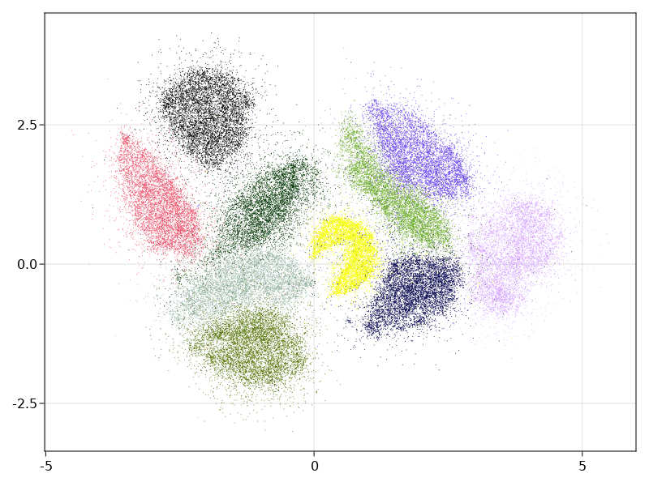
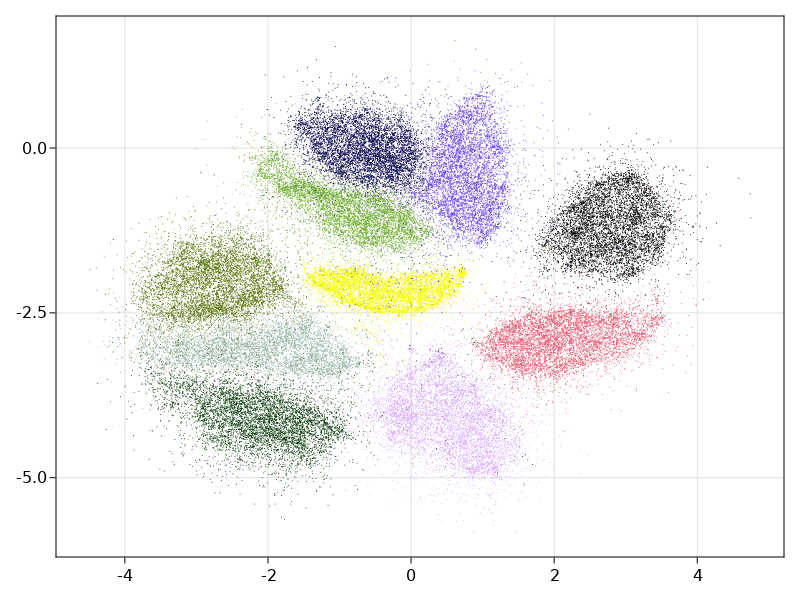
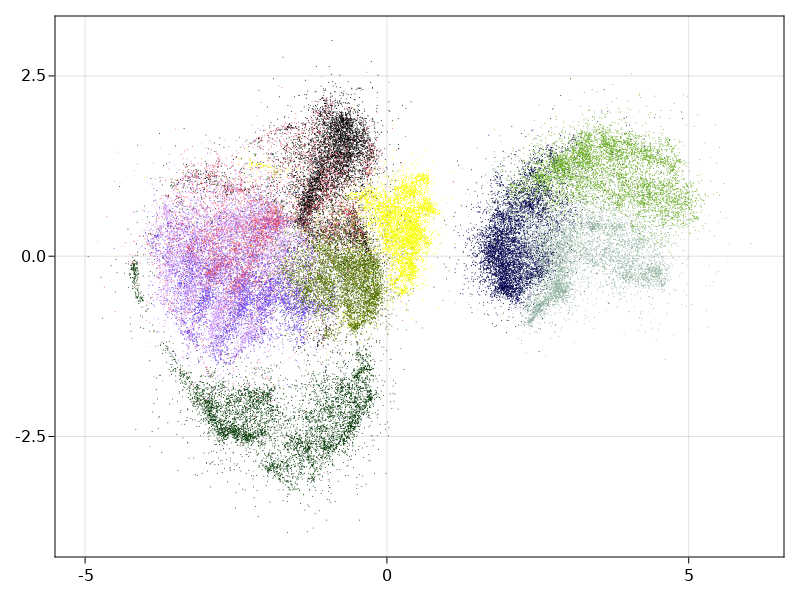
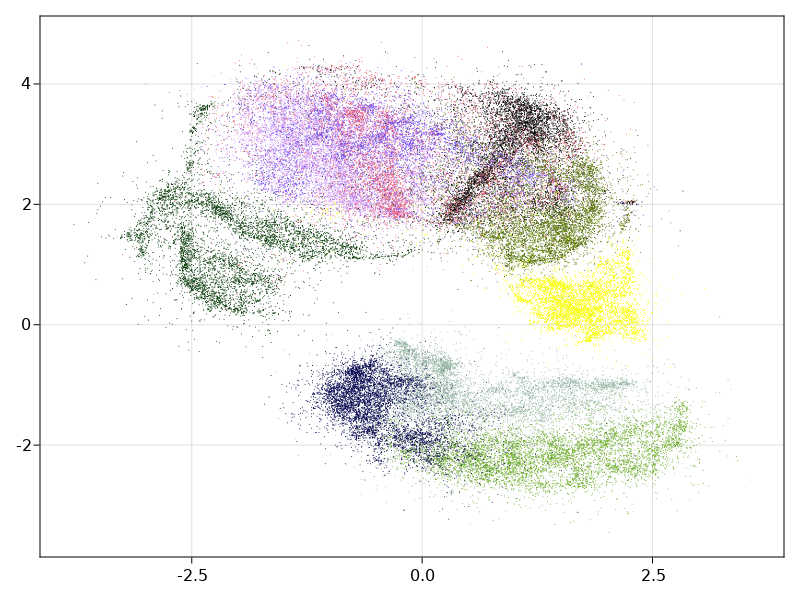

# A data embedding tool and related data analysis or clustering

The crate provides:

1. Some variations on data embedding tools from t-Sne (2008) to Umap(2018).
   Our implementation is a mix of the various embedding algorithms
    recently published and mentioned in References.

   - The graph is initialized by the Hnsw nearest neighbour algorithm.  
     This provides for free, sub-sampling in the data to embed by considering only less densely occupied layers (the upper layers). This corresponds generally to a subsampling of 2%-4%, but can give a guarantee as the distance beetween points leaved out the sampling and its nearest sampled neighbour are known. The hnsw structure thus enables also an iterative/hierarchical initialization of the embedding by taking into account an increasing number of layers.
  
   - The preliminary graph built for the embedding uses an exponential function of distances to neighbour nodes (as in Umap). It is possible to modulate the initial edge weight by :
     - Considering a power of the distance function to neighbours (**See documentation in module EmbedderParams**).  
     - Increase or decrease the impact of the local density of points around each node. There is no symetrization of the graph. (except when initializing the embedding with diffusion maps in this case it is done as in t-sne or LargeVis). We use the diffusion maps algorithm (Lafon-Keller-Coifman).

   - We also use a cross entropy optimization of this initial layout but take into account the initial local density estimate of each point when computing the cauchy weight of an embedded edge.
   
 2. Some by-products :
   
    - an implementation of range approximation and approximated SVD for dense and/or row compressed matrices as described in explicited in the svdapprox module and the paper of Halko-Tropp (Cf. [Tsvd](https://arxiv.org/abs/0909.4061)).
  
        - The *adaptative_range_finder_matrep* algorithm is less precise than *subspace_iteration_csr* (which uses QR stabilization)
        but can work on larger matrices for example on sparse matrices with a million rows.

    - An estimation of the data intrinsic dimension as described in:  
            Levina E. and Bickel P.J NIPS 2004.  See [paper](https://www.stat.berkeley.edu/~bickel/mldim.pdf).
  
    - a Diffusion Maps implementation.

## *The crate is still in a preliminary state*

It will provide a single-linkage hierarchical clustering function and an implementation of the Mapper algorithm using the C++ **Ripser** module from U. Bauer.

## Building

 The crate provides 2 features to choose between openblas-static, intel-mkl-static as defined in the  **ndarray-linalg** crate. 
So **--features "openblas-static"** , **--features "intel-mkl-static"** must be passed to cargo to compile. Alternatively define the default in Cargo.toml.
## Results

These are preliminary results.
Timings are given for a 8-core i7 @2.3 Ghz laptop.

### Embedder examples

1. MNIST digits database  Cf [mnist-digits](http://yann.lecun.com/exdb/mnist/)

It consists in 70000 images of handwritten digits of 784 pixels

- initialized by an approximated svd.
It tooks 20s to run, of which 9s were spent in the ann construction.

- hierarchical initialization

It took 22s of which 9s were spent in the ann construction.

- The estimated intrinsic dimension of the data is 17.7 with standard deviation depending on points: 6.

2. MNIST fashion database Cf[mnist-fashion](https://github.com/zalandoresearch/fashion-mnist/tree/master/data/fashion)

It conssits in 70000 images of clothes.

- initialized by an approximated svd.
  
  

   time : 29s
- hierarchical initialization
  (This is only useful for large data embedding where we initialize the embedding for one layer of the Hnsw structure with the embedding of 
  of the layer just above to speed up the process).

 

 time : 34s 
   
- The estimated intrinsic dimension of the data is 20.9 with standard deviation depending on points : 11.8

### Randomized SVD

The randomized SVD is based on the paper of [Halko-Tropp](https://epubs.siam.org/doi/abs/10.1137/090771806).
The implemntation covers full matrices or matrices in compressed row storage as provided in the *sprs* crate.

We implement two approximations of the SVD.
       - *subspace_iteration_csr* , corresponds to algo 4.4 in Tropp paper. It uses QR stabilization.  
       - *adaptative_range_finder_matrep* correponds to algo 4.2 in Tropp paper.  The algorithm is less precise than *subspace_iteration_csr* but can work on larger matrices for example on sparse matrices with a million rows.
### Mapper

## Installation

compile with : 

* cargo build --release --features "openblas-static" to link statically with rust downloaded openblas
  
* cargo build --release --features "intel-mkl-static" to link with mkl intel's library 
    (intel mkl will be automatically downloaded, see README.md of crate ndarray-linalg)

* cargo build --release  --features "openblas-system" will try to link with system openblas and system lapacke
  (see the build.rs to modify it if needed)
## References

- Visualizing data using t_sne.
  Van der Maaten and Hinton 2008.

- Visualizing Large Scale High Dimensional Data
  Tang Liu WWW2016 2016 [LargeVis](https://arxiv.org/pdf/1602.00370.pdf)
  
- Phate Visualizing Structure and Transitions for Biological Data Exploration
  K.R Moon 2017.

- Umap: Uniform Manifold Approximation and Projection for Dimension Reduction.
  L.MacInnes, J.Healy and J.Melville 2018

## License

Licensed under either of

1. Apache License, Version 2.0, [LICENSE-APACHE](LICENSE-APACHE) or <http://www.apache.org/licenses/LICENSE-2.0>
  
2. MIT license [LICENSE-MIT](LICENSE-MIT) or <http://opensource.org/licenses/MIT>

at your option.

This software was written on my own while working at [CEA](http://www.cea.fr/)
